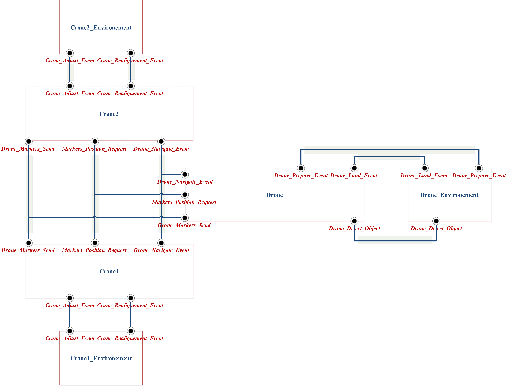
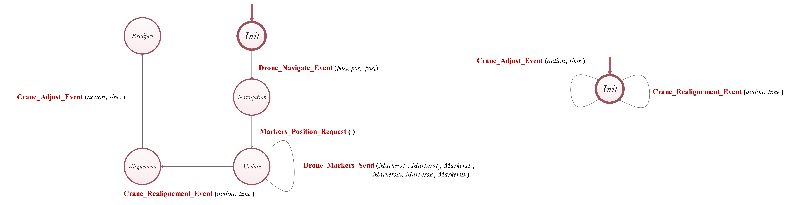
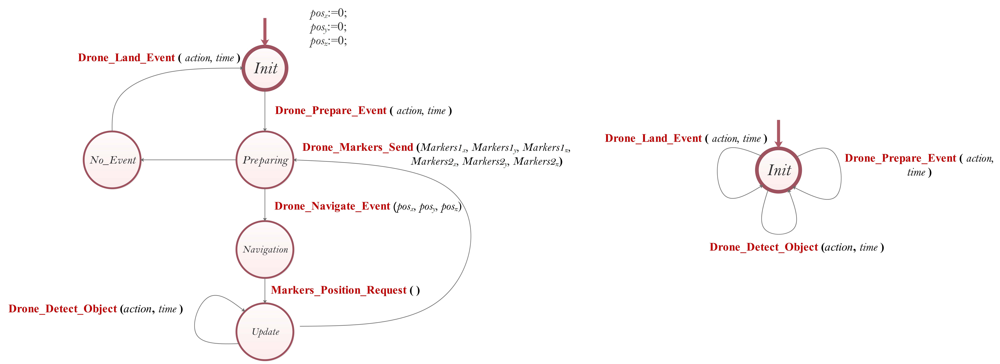

# Drone-Cranes
The scenario is taken from the CPS4EU project where two cranes orchestrate the lifting using a drone.

1 - **Brief Description:**

The use case shows how a drone can act as a visual sensor providing it feedback while the cranes are lifting a load. The drone's camera will estimate the position of the markers on the object being lifted. Based on that, the cranes can calculate the alignment of the load and readjust the position of the object being lifted. It is helpful when a heavy object is being lifted. The two cranes' misalignment of the lifted load  needs to be avoided. The use case is modeled in BIP.

 

2 - **The Use Case Architecure:**

The architecture is composed of six primitives components: Drone, Crane1, Crane2, and their modeled environment.

 

3 - **The Crane Behavior:**

Two automata modeled in BIP. The left is modeling the crane behavior and the right is modeling the crane environement.

3 - **The Drone Behavior:**

Two automata modeled in BIP. The left is modeling the drone behavior and the right is modeling the drone environement.

4 - **Statistical Model Checking:**

What is the probability that both cranes receive the object markers globally during their execution? c1 refers to the first crane, and 2 refers to the second crane. m refers to the marker value 0 or 1. 
****G{100} (c1.m==c2.m)****

- Unsynchronized version. verdict = 36%
- Synchronized version. verdict = 100% 

===============================================================

****Baouya Abdelhakim****

****Researcher, Verimag Lab****

****Université Grenoble Alpes, France****

****The use of the description is under Licence. Contact me.****
